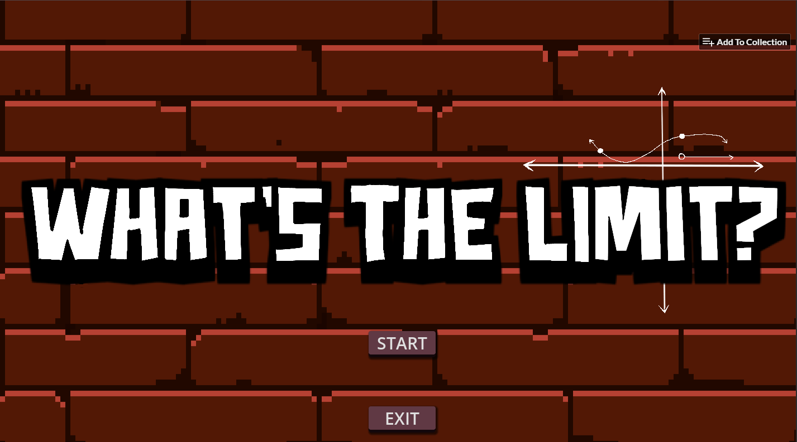
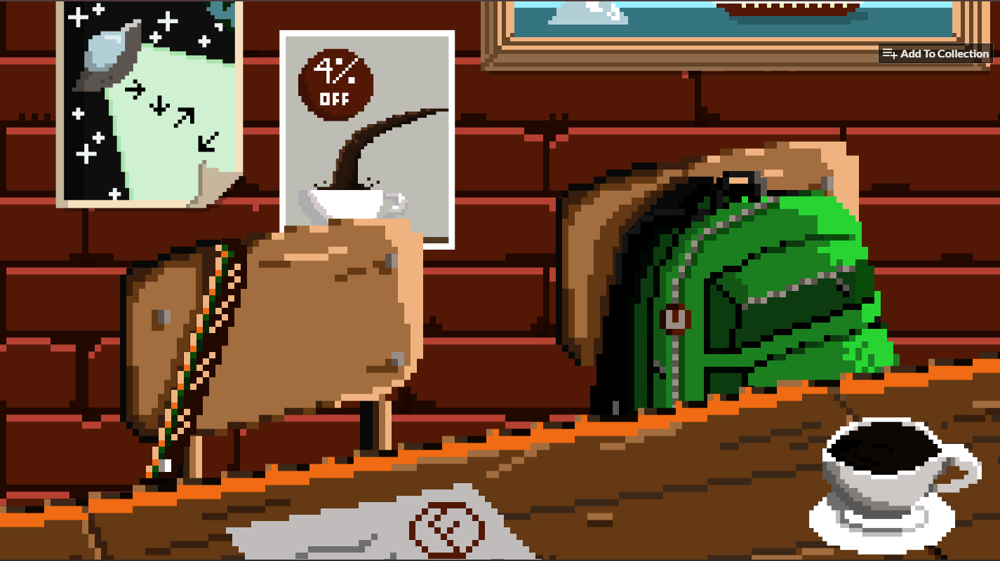

# Escape Room: What's the Limit? 🧩☕ [Made in 2024]

Welcome to **What's the Limit?**, an immersive escape room and puzzle game built using the **Godot Engine** (v4.2.2). Test your wits, solve math/logic-based puzzles, and find a way out of the room before time runs out! 

---

## 📸 Screenshots

### Title Screen

### The Scene

---

## 🎮 Gameplay & Features
* **Escape Room Mechanics:** Interact with objects, find clues, and piece together the solution to escape the room.
* **Math/Logic Puzzles:** Put your problem-solving skills to the test with clever mathematical and analytical riddles hidden in the environment.
* **Pixel Art Style:** Enjoy a charming, retro pixel-art aesthetic designed to create an engaging atmosphere.

---

## 🛠️ Getting Started / Playing the Game

1. Clone this repository to your local machine.
2. Download [Godot Engine version 4.2.2](https://godotengine.org/).
3. Open the Godot Project Manager, click **Import**, and select the `project.godot` file inside this project folder.
4. Run the project directly from the editor (Press `F5` or the Play button).

---

## 📝 License
This project is open-source and available under the [MIT License](LICENSE).
